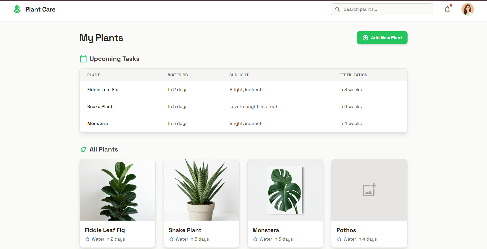

# 🌱 Plant Care Dashboard

A clean and responsive **Indoor Plant Care Dashboard** built as a lightweight static frontend. The interface helps users view their indoor plants and keep track of upcoming care tasks such as watering, sunlight requirements, and fertilization.

## 🌱 Plant Care Dashboard

* A clean and responsive **Indoor Plant Care Dashboard**...

 <p align="center">
   
 </p>


## ✨ Features

* 🌿 **Plant collection** — Displays commonly managed indoor plants such as Fiddle Leaf Fig, Snake Plant, Monstera, and Pothos.
* 📅 **Upcoming tasks** — Shows watering schedules, sunlight requirements, and fertilization reminders.
* 🔎 **Plant search UI** — Responsive search fields are available on desktop and mobile layouts.
* ➕ **Add New Plant UI** — Includes an interface element for adding plants.
* 🔔 **Notifications UI** — Notification indicator with an active alert badge.
* 📱 **Responsive design** — Layout adapts to mobile, tablet, and desktop screen sizes.
* 🎨 **Modern UI** — Uses a clean plant-focused visual style with cards, tables, icons, shadows, and responsive spacing.

## 🛠️ Tech Stack

* **HTML5** — Page structure and semantic markup
* **Tailwind CSS** — Utility-first styling via CDN
* **Google Fonts** — Space Grotesk and Noto Sans
* **Material Icons Outlined** — Interface icons

## 📁 Project Structure

```text
plant_UI/
├──assets/
|        └── preview.png    # imgage
|
├── index.html      # Main dashboard page
└── README.md       # Project documentation
```

## 🚀 Getting Started

### 1. Clone the repository

```bash
git clone https://github.com/suyXcode/plant_UI.git
```

### 2. Open the project

```bash
cd plant_UI
```

### 3. Run the application

This is a static HTML project, so no package installation or build step is required.

You can open `index.html` directly in a browser, or use a local development server such as VS Code Live Server.

For example, with Python:

```bash
python -m http.server 8000
```

Then open:

```text
http://localhost:8000
```

## 🖥️ Dashboard Overview

The dashboard is organized into two primary sections:

### Upcoming Tasks

A table summarizes the care schedule for each plant:

| Plant           | Watering  | Sunlight                | Fertilization |
| --------------- | --------- | ----------------------- | ------------- |
| Fiddle Leaf Fig | In 2 days | Bright, indirect        | In 3 weeks    |
| Snake Plant     | In 5 days | Low to bright, indirect | In 6 weeks    |
| Monstera        | In 3 days | Bright, indirect        | In 4 weeks    |

### All Plants

Plant cards provide a quick overview of the collection, including the plant name and next watering reminder.

## 🎨 UI Design

The dashboard uses:

* A light stone-colored background
* Green as the primary accent color
* White content cards with subtle borders and shadows
* Rounded UI components
* Responsive grid layouts
* Material Icons for common actions and plant-care indicators

## ⚙️ Current Scope

This repository currently contains a **frontend UI prototype**. The controls and data are presented as interface elements rather than a connected plant-management application.

There is currently no backend, database, authentication system, or JavaScript application logic included in the repository.

## 🔮 Possible Improvements

* [ ] Add functional plant search and filtering
* [ ] Implement the **Add New Plant** workflow
* [ ] Add plant details and editing functionality
* [ ] Store plant data using a backend/database
* [ ] Add real watering and fertilization reminders
* [ ] Implement browser notifications
* [ ] Add plant health tracking
* [ ] Add authentication and user profiles
* [ ] Replace static data with dynamic API/database data
* [ ] Add dark mode

## 📄 License

This project is intended for learning, experimentation, and frontend UI development. Add a project-specific license if you plan to distribute or reuse the code publicly.

## 👨‍💻 Author

**Suyash**

GitHub: [@suyXcode](https://github.com/suyXcode)

---

⭐ If you find this project useful, consider giving the repository a star!
